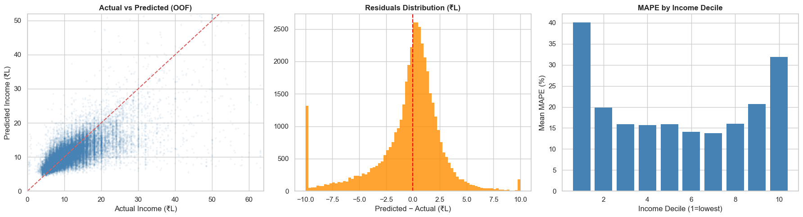
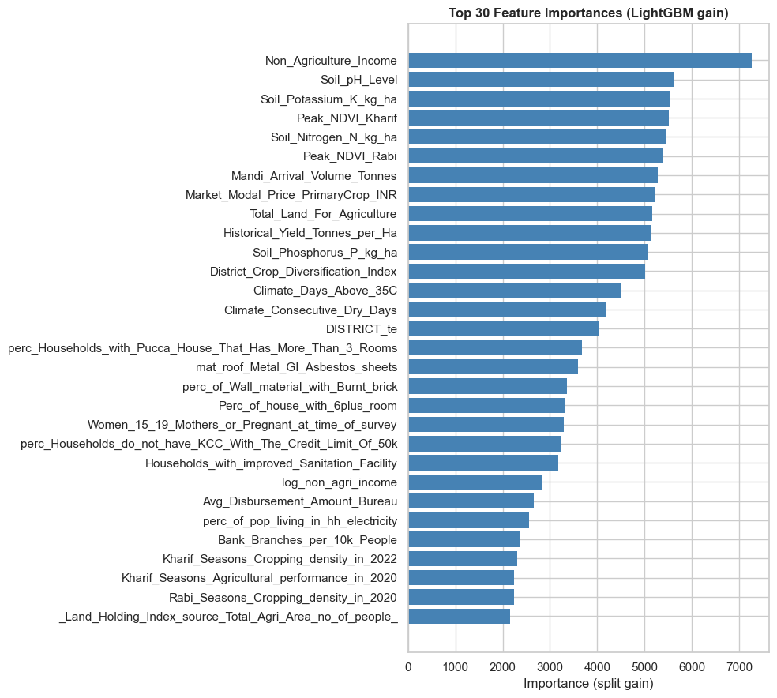
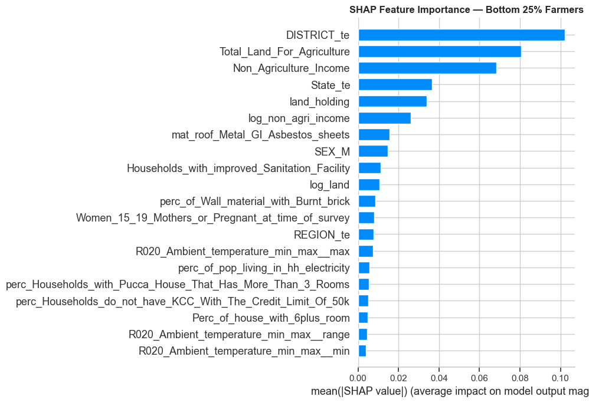

# AgriIntel 🌾
### Predicting Farmer Income in India using Machine Learning

A competition ML pipeline built to predict total farmer income across \~43,000 Indian farmers, using agricultural, financial, and socio-economic data. The final model achieves **\~20.89% MAPE**— a 9 percentage point improvement over the Ridge baseline - through LightGBM with Bayesian hyperparameter tuning, 14 externally sourced district-level features, and seasonal volatility signals engineered from 3 years of agricultural score data.

---

## Project Structure

```
agriintel/
├── data/
│   ├── enriched_train_data.zip   # Training set with external enrichment merged in
│   └── test_data.csv
├── docs/                         # Approach document
├── agriintel.ipynb               # Complete pipeline
├── requirements.txt
└── .gitignore
```

---

## Problem Statement

Predict `Total_Farmer_Income` (in ₹) for a dataset of \~43,000 Indian farmers. The evaluation metric is **MAPE (Mean Absolute Percentage Error)**. The target is highly right-skewed (skewness ≈ 23.15, range ₹29K – ₹8Cr), so a `log1p` transformation is applied before training and reversed with `expm1` at inference.

---

## Results

| Model | 5-Fold CV MAPE |
|---|---|
| Ridge Regression (baseline) | \~29.91% |
| LightGBM (default params) | \~21.28% |
| **LightGBM + Optuna tuning** | **\~20.89% ± 0.46%** |

The tuned LightGBM cuts error by \~9 percentage points vs baseline. Train/val MAPE spread across folds stays under 2pp - no meaningful overfitting. Results are fully reproducible - `random_state=42` is set on the KFold splits, LightGBM, and Optuna's TPE sampler.

The model performs best in deciles 3–7 (\~14–16% MAPE). Error is higher at the extremes - bottom decile (\~41%, a known MAPE property at low income levels) and top decile (\~32%, where sparse data and unobserved factors limit predictability).

The single biggest win in the entire pipeline wasn't the model choice or the tuning - it was applying `log1p` to the target. The income distribution has a skewness of 23, and training directly on that would have let a handful of high earners dominate every gradient update.



---

## The Interesting Parts

### External data enrichment paid off more than expected
The competition data alone wasn't enough. 14 district-level features were pulled from public sources - APMC mandi prices, satellite NDVI, soil NPK, climate stress indicators, cold storage access, bank branch density - all keyed on `DISTRICT` and merged into both train and test. Features 2–13 in the final top 30 are almost entirely from this enrichment. The raw district-level data ended up driving the model more than the engineered transforms of the original columns.

### Not flattening the seasonal scores
Most approaches would average the 2020, 2021, 2022 agricultural scores into one number. Instead, the temporal structure was preserved and the following were engineered:
- **Trend** (linear slope over 3 years) - is this farmer improving or declining?
- **Volatility** (std dev across years) - how consistent are they season to season?
- **Kharif/Rabi ratio** - season dependency risk

This matters beyond model accuracy: stable farmers (Q1 volatility) earn 15–20% more at the median than volatile ones (Q4), and volatility turns out to be a strong credit risk signal independent of average income - which feeds directly into Bonus Task B.

### Temperature column rescue
15 temperature columns were stored as strings in `'24.63/31.27'` format - completely unusable by a model. Parsed into `_min`, `_max`, and `_range` per season-year, unlocking all of them.

---

## Approach Summary

### 1. EDA

- **Target distribution:** Raw income is extremely right-skewed (skew ≈ 23); `log1p`-transformed for training.
- **Missing values:** Three-tier handling - `Avg_Disbursement_Amount_Bureau` (43% missing) converted to a binary `has_bureau_history` flag; address/ownership columns (\~35% missing) mode-imputed per state with a missingness flag; remaining numerics (<1% missing) median-imputed on train, applied to test.
- **Regional patterns:** WEST and SOUTH regions have the highest median incomes. EAST shows the lowest, consistent with smaller land holdings and subsistence farming. A 3–4× income gap exists between the highest and lowest median-income states.
- **Key correlates:** `Non_Agriculture_Income` is the strongest single predictor (|r| > 0.55), followed by land size and agricultural scores.

### 2. External Data Enrichment

14 district-level features merged via a `DISTRICT` key:

- APMC market modal prices and mandi arrival volumes
- Climate stress proxies (days above 35°C, consecutive dry days)
- Soil NPK levels and pH
- District crop diversification index and historical yield
- Kharif and Rabi NDVI from satellite imagery
- Bank branch density and cold storage availability

### 3. Feature Engineering

- **Temperature parsing:** String columns in `'min/max'` format parsed into `_min`, `_max`, and `_range` per season-year (15 columns unlocked).
- **Seasonal trajectory features:** Temporal structure preserved across 2020–2022:
  - `kharif_score_trend` / `rabi_score_trend` - linear slope of scores over 3 years
  - `kharif_score_volatility` / `rabi_score_volatility` / `overall_score_volatility` - std dev across years
  - `kharif_rabi_ratio` - season dependency ratio
  - `kharif_rainfall_yoy_delta` - year-over-year rainfall change as a climate shock proxy
- **Access scores:** `mandi_access_score = 1 / (distance + 1)` and `railway_access_score = 1 / (distance + 1)` - non-linear proximity transforms.
- **Composite indices:** `soil_npk_index` (mean of N, P, K), `ndvi_composite` (average peak NDVI for Kharif and Rabi), `market_land_interaction` (modal price × log(land)).
- **Log transforms:** `log_non_agri_income`, `log_land` for the two most skewed strong predictors.

### 4. Encoding

- **Smoothed target encoding** (k=10) for `State`, `REGION`, `DISTRICT`
- **Ordinal encoding** (0/1/2) for Good/Average/Poor quality columns
- **One-hot encoding** for `SEX`, `MARITAL_STATUS`, `Ownership`, `Address type`

### 5. Modelling

- **Baseline:** Ridge regression with `StandardScaler` (alpha=10), 5-fold CV.
- **Primary model:** LightGBM with MAPE as the native training metric, 5-fold CV with out-of-fold (OOF) predictions. Test predictions averaged across all 5 fold models.
- **Tuning:** Optuna Bayesian search over 40 trials with `TPESampler(seed=42)`. Parameters tuned: `num_leaves`, `learning_rate`, `min_child_samples`, `subsample`, `colsample_bytree`, `reg_alpha`, `reg_lambda`.

### 6. Top Features (by LightGBM split gain)

| Rank | Feature | Source |
|---|---|---|
| 1 | `Non_Agriculture_Income` | Original data |
| 2 | `Soil_pH_Level` | External enrichment |
| 3 | `Soil_Potassium_K_kg_ha` | External enrichment |
| 4 | `Peak_NDVI_Kharif` | External enrichment |
| 5 | `Soil_Nitrogen_N_kg_ha` | External enrichment |
| 6 | `Peak_NDVI_Rabi` | External enrichment |
| 7 | `Mandi_Arrival_Volume_Tonnes` | External enrichment |
| 8 | `Market_Modal_Price_PrimaryCrop_INR` | External enrichment |
| 9 | `Total_Land_For_Agriculture` | Original data |
| 10 | `Historical_Yield_Tonnes_per_Ha` | External enrichment |



---

## Bonus Tasks

### Bonus A - Intervention Recommender

For the bottom 25% of farmers by predicted income (threshold ≈ ₹6.2 lakh), SHAP `TreeExplainer` values were computed on a 2,000-farmer sample. Features were classified as **Controllable** (actionable via behaviour or policy) vs **Fixed** (geography, rainfall).

For this subgroup, the top SHAP drivers are `DISTRICT_te`, `Total_Land_For_Agriculture`, and `Non_Agriculture_Income` - suggesting that for the poorest farmers, *where they are* and *how much land they have* matters more than anything else. Notably, `log_non_agri_income` also appears in the top 6, confirming the log transform added signal for this segment even where the raw column dominates globally.

Counterfactual uplift was simulated by shifting the top two controllable levers from a bottom-quartile farmer's current median to the 75th percentile of the full population:

| Intervention | Simulated Income Gain |
|---|---|
| Mandi access: \~80 km → \~10 km | +₹1.1 lakh (\~14–18%) |
| Adding a secondary income stream | +₹0.8 lakh (\~10–13%) |



These are model-derived estimates, not causal claims.

### Bonus B - Seasonal Volatility Modelling

`overall_score_volatility` (std dev of all 6 seasonal scores per farmer) was used to bucket farmers into volatility quartiles:

- Q1 (stable) farmers earn **15–20% more** at the median than Q4 (volatile) farmers.
- Correlation between `overall_score_volatility` and log(income) ≈ −0.12.
- `kharif_score_trend` (slope of improvement 2020–2022) positively correlates with income - improving farmers earn more.

**Credit risk implication:** A farmer with higher average income but volatile scores is a worse credit risk than one with slightly lower but stable income - the variance of cash flows predicts default probability better than the mean alone. Proposed framework:
- **Q1 (stable)** → standard credit products
- **Q4 (volatile)** → weather-indexed insurance as a condition of credit

---

## Setup & Installation

**1. Clone the repository:**

```bash
git clone https://github.com/exharmonic/agri-intel-farmer-income-predictor.git
cd agri-intel-farmer-income-predictor
```

**2. Create a virtual environment:**

```bash
python -m venv venv
source venv/bin/activate  # On Windows: venv\Scripts\activate
```

**3. Install dependencies:**

```bash
pip install -r requirements.txt
```

**4. Run the notebook:**

The dataset has been compressed. `pandas` handles `.zip` files natively, so no manual extraction needed. Launch Jupyter and run all cells top to bottom:

```bash
jupyter notebook agriintel.ipynb
```

**Stack:** `pandas` · `numpy` · `matplotlib` · `seaborn` · `scikit-learn` · `lightgbm` · `optuna`

---

*Competition project - Team 7*